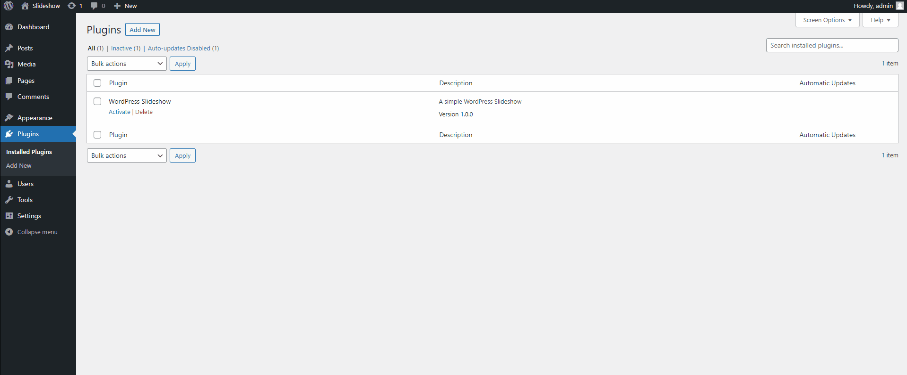
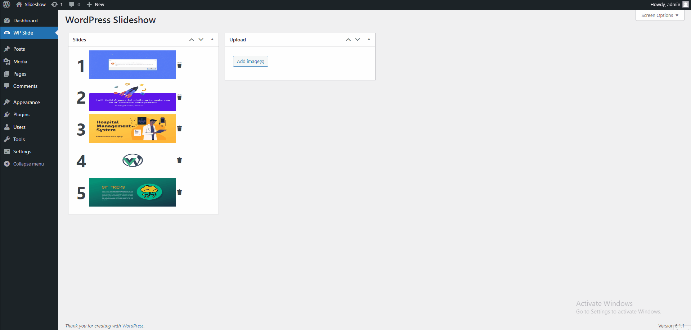

 
# WordPress Slideshow Plugin  
There are many really good sliders and carousels around. The majority of them were born many years ago. Because of the limitations of the time, they use a lot of javascript, event listeners, and a swarm of other things to handle sliding behavior.

WordPress Slideshow Plugin is a new beginning - using what browsers supports now. All of the sliding, dragging, snapping, and so on are now native browser behavior rather than javascript. WordPress Slideshow Plugin can even be used in a non-JS mode!

This provides superior performance, user experience, touch experience, and simplicity.

At the same time, it has support for any input device in the world - touch, mouse, keyboards, touch pads, track pads, pencils, assitive devices, controllers etc.

W3 validation, 100% WCAG compatible, Super high Google Lighthouse scores, 

 
## Run Locally  

**Manual Installation**

1. **Download** the plugin
1. **Unzip** `wpcs-devkabir` folder to the `/wp-content/plugins/wordpress-slideshow` directory
1. **Activate the plugin** through the 'Plugins' menu in WordPress
1. It's finished !

## Usage
 1. **How to create slideshow**

 1. **How to reorder and delete sliders**
 

